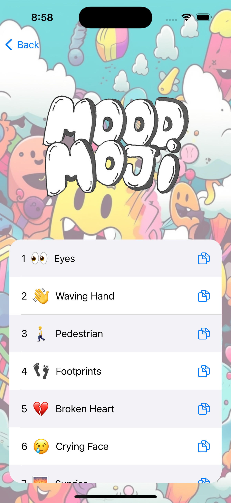

# Moodmoji 📱🤖

Moodmoji is a fun and interactive iOS application that produces a list of matching emojis based on a given string of text. Simply input your text and Moodmoji will generate relevant emojis that you can easily copy and share! 🎉

<p align="center">
   
</p>

This project is my first learning experience with Swift, and it's powered by OpenAI's API. 🧠💡

## Description 📝

Given a string of text, Moodmoji generates a list of matching emojis that can be easily copied and used in your conversations. Whether you're expressing your emotions, describing a situation, or just having fun, Moodmoji is here to add a touch of creativity to your messages! 🚀😄



## Installation 💻

1. Clone the Moodmoji repository:
   ```
   git clone https://github.com/antoinekllee/Moodmoji.git
   ```

2. Open the project in Xcode.

3. Create a `Secrets.plist` file in the project and add your OpenAI API key:
   ```
   Key: OPENAI_KEY
   Value: YOUR_API_KEY
   ```

4. Build and run the application on your iOS device or simulator.

## Technologies Used 🛠️

- Swift
- OpenAI API

## License 📄

This project is licensed under the MIT License - see the [LICENSE](LICENSE.md) file for details.
